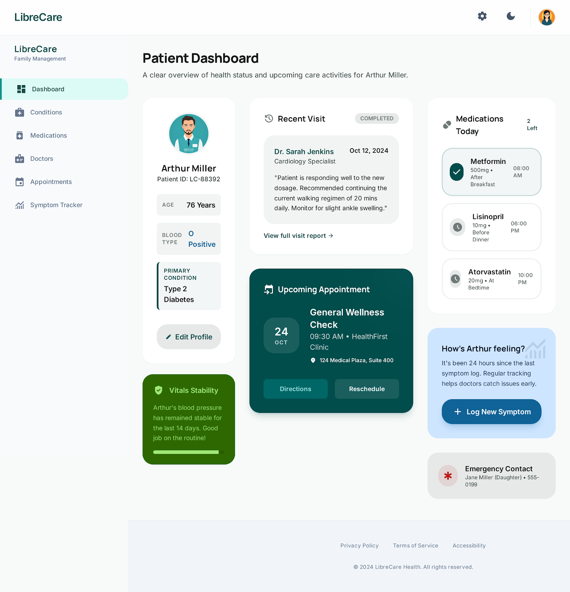
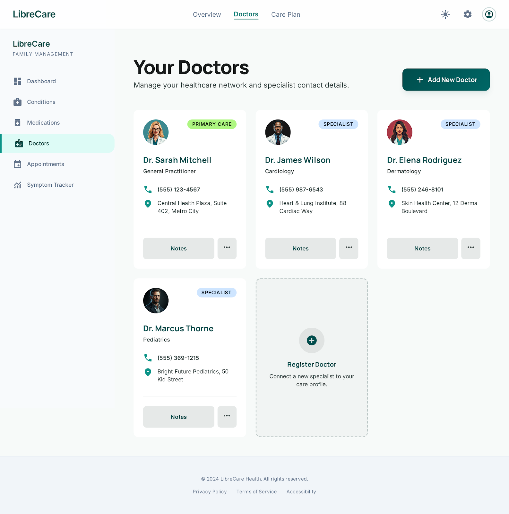
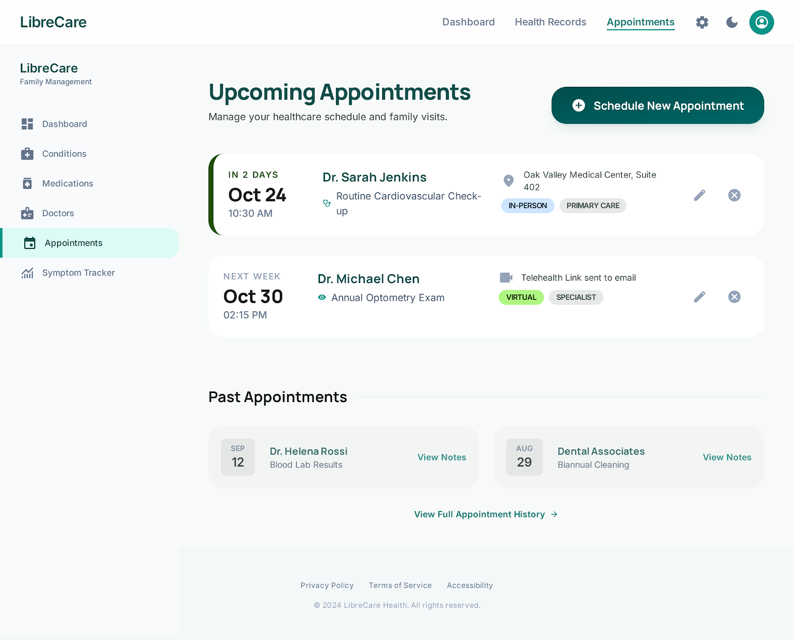

# LibreCare

LibreCare is a an app designed for individuals, families, and caregivers who
manage the health of loved ones.

It helps track doctors, appointments, conditions, medications, and other
important information, making caregiving simpler and more organized.

By consolidating critical health data in one place, LibreCare reduces stress and
ensures nothing important is overlooked.

## Status

Early development

## Overview

LibreCare is a locally-run application built using ASP.NET Core Razor Pages.
Although it uses web technologies under the hood, it is designed to behave like
a desktop application.

Planned characteristics:

- Runs locally (no external hosting required)
- Uses SQLite for lightweight, file-based storage
- May be packaged with Electron.NET for a desktop-like experience
- Potential future distribution via MSI installer

## Screenshots (Mockups)

You can include screenshots like this:





For all the mockups see docs/public/mockups.

_These are initial mockups and may not reflect the current implementation._

## Goals

- Provide a fast, simple local tool for caregivers
- Avoid complex deployment or cloud dependencies
- Keep everything self-contained and easy to install

## 🛠 Tech Stack

- ASP.NET Core Razor Pages
- SQLite
- (Planned) Electron.NET
- (Planned) Windows MSI installer

## 🚀 Getting Started

### Prerequisites

- .NET SDK (version 10.0 or later)

### Run locally

```bash
git clone https://github.com/a1a2d1/libre-care.git
cd libre-care
dotnet run
```

Then open your browser to:

```bash
http://localhost:5000
```

## Roadmap (rough)

- [x] First working feature ("first slice")
- [ ] Basic UI layout
- [ ] SQLite integration
- [ ] Local data persistence
- [ ] Electron.NET wrapper
- [ ] MSI installer packaging

## Notes

- This is an early-stage project--expect breaking changes
- Structure and tooling may evolve significantly

## License

AGPL-3.0 license--see LICENSE
